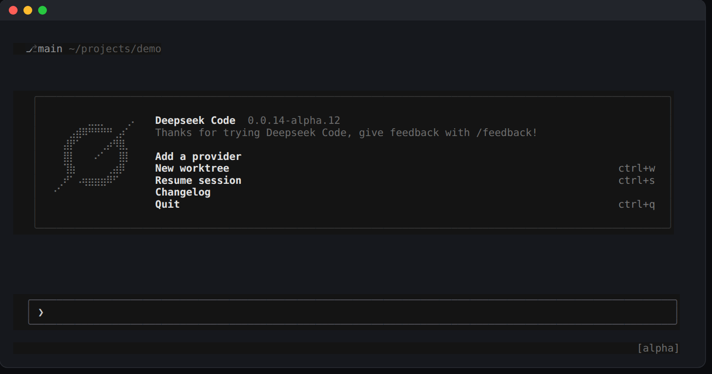

# DeepSeek Code (dscode)

A terminal UI for AI coding agents, powered by DeepSeek Harness.

> Not an official DeepSeek or xAI project.



## Install

```sh
npx @hqzhao95/dscode
```

Prebuilt on Linux x86_64 and macOS Apple Silicon. Other hosts build the TUI from this repo (`scripts/build-deepseek-tui.sh`).

The first run sets everything up. After that, use:

```sh
dscode
```

## Update

```sh
dscode update
```

## Uninstall

```sh
rm -rf ~/.dsh/profiles/dscode ~/.local/bin/dscode
```

## Presets

Use `/preset` or `Ctrl+Y` to switch presets.

Shipped presets:

- `standard`
- `code`
- `minimal`
- `cordis`

## Plugins

Manage dsh plugins from inside dscode:

```text
/dsh plugins                   list installed plugins
/dsh add <package|git-url>     install a plugin
/dsh remove <name>             uninstall a plugin
```

Or from the CLI:

```sh
dsh plugin --profile dscode add <pkg>
```

## Documentation

See [docs/dscode-usage.md](docs/dscode-usage.md).
